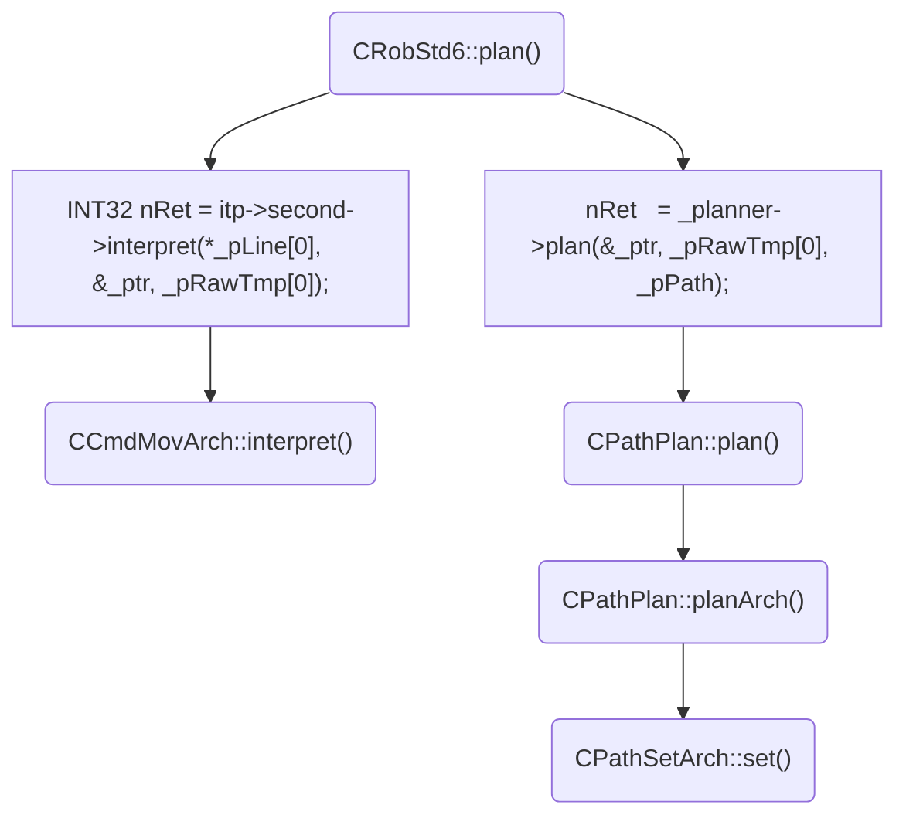

## Tue Mar 9

Path planning code flow for doing an arch motion. My plan is to move this part of code into a non-realtime thread.

> Written with [StackEdit](https://stackedit.io/).
<!--stackedit_data:
eyJoaXN0b3J5IjpbLTEwNTgyMzY0MTZdfQ==
-->