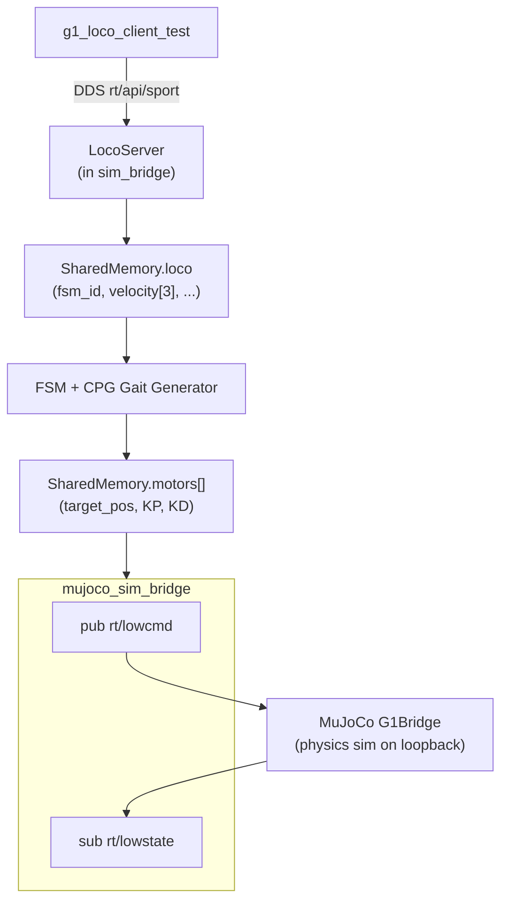
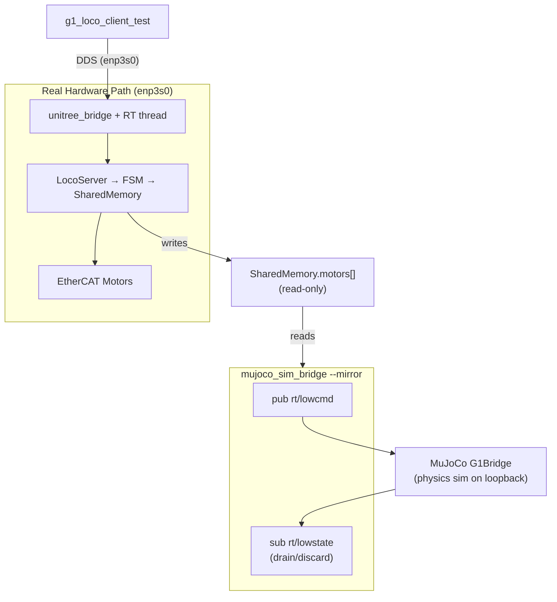
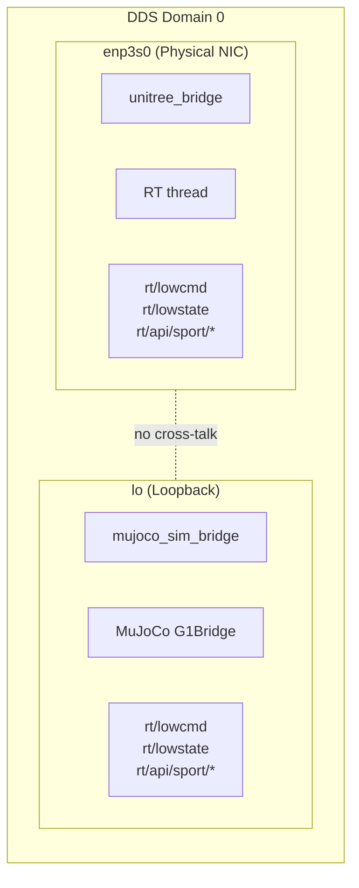
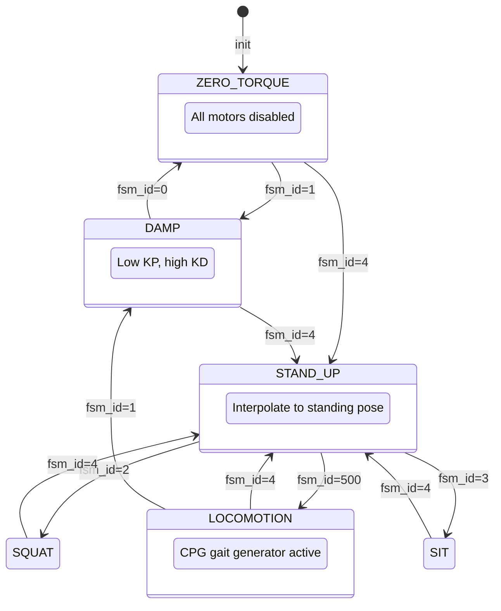
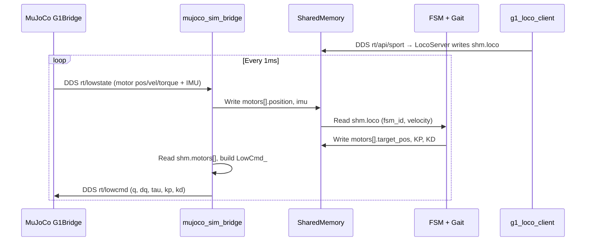

# MuJoCo Simulation Bridge for G1 Robot

## Overview

The MuJoCo simulation bridge connects the `g1_motor_control` project to the MuJoCo physics
simulator (`unitree_mujoco`), allowing high-level locomotion commands to drive a simulated G1
robot. It supports two operating modes:

- **Standalone mode** — Full simulation without hardware. Runs its own FSM, gait generator,
  and service API, then forwards motor commands to MuJoCo over loopback DDS.
- **Mirror mode (`--mirror`)** — Digital twin. The real robot runs on hardware while MuJoCo
  mirrors its movements in real-time by reading the same shared memory motor commands.

## Architecture

### Standalone Mode (no hardware)



The bridge creates its own shared memory segment, initializes the FSM and service servers,
then runs a 1kHz control loop:

1. **receive_lowstate** — DDS take from `rt/lowstate`, write motor feedback + IMU to shared memory
2. **fsm_update** — `g1_fsm_update()` reads `shm.loco`, generates motor targets in `shm.motors[]`
3. **publish_lowcmd** — Read `shm.motors[]`, build `LowCmd_` message, DDS write to `rt/lowcmd`

### Mirror Mode (digital twin with real hardware)



The bridge attaches to the existing shared memory (owned by the RT thread), then runs a
1kHz loop that only forwards motor commands to MuJoCo:

1. **publish_lowcmd** — Read `shm.motors[]`, build `LowCmd_`, DDS write to `rt/lowcmd`
2. **receive_lowstate** — Drain `rt/lowstate` (discard — real feedback comes from hardware)

### DDS Isolation

Hardware and simulation run on separate network interfaces within the same DDS domain 0:



CycloneDDS binds to the specified interface, so traffic never crosses between hardware and
simulation even though they share the same topic names and domain.

### FSM State Machine

The bridge (in standalone mode) runs the same FSM as the real hardware path:



### Control Loop (1kHz)



### Joint Index Compatibility

Both projects use identical 29-DOF joint indexing (0-28):

| Index | Body Part | Joints |
|-------|-----------|--------|
| 0-5 | Left Leg (6 DOF) | HipPitch, HipRoll, HipYaw, Knee, AnklePitch, AnkleRoll |
| 6-11 | Right Leg (6 DOF) | HipPitch, HipRoll, HipYaw, Knee, AnklePitch, AnkleRoll |
| 12-14 | Waist (3 DOF) | Yaw, Roll, Pitch |
| 15-21 | Left Arm (7 DOF) | ShoulderPitch/Roll/Yaw, Elbow, WristRoll/Pitch/Yaw |
| 22-28 | Right Arm (7 DOF) | ShoulderPitch/Roll/Yaw, Elbow, WristRoll/Pitch/Yaw |

No joint remapping is needed between `g1_motor_control` and `unitree_mujoco`.

## Files

### Created

| File | Description |
|------|-------------|
| `examples/mujoco_sim_bridge.cpp` | Main bridge executable — `MuJoCoSimBridge` class with standalone and mirror modes |
| `run_mujoco_sim.sh` | Helper launch script (defaults to `--network_interface=lo`) |

### Modified

| File | Change |
|------|--------|
| `examples/CMakeLists.txt` | Added `mujoco_sim_bridge` build target with DDS, shared memory, FSM, and gait dependencies |
| `src/g1_fsm.h` | Added `last_update_time` field to `G1FSMContext` for dynamic dt computation |
| `src/g1_fsm.c` | Replaced hardcoded `dt = 0.001f` with elapsed-time computation so the gait generator works at any loop frequency |

### Key Dependencies Reused

| Component | File | Purpose |
|-----------|------|---------|
| DDS message types | `src/unitree_hg.h/.c` | `LowCmd_`, `LowState_` structs and DDS descriptors |
| Service API types | `src/unitree_api.h/.c` | Request/Response for `rt/api/sport/*` |
| Loco server | `src/g1_loco_server.h/.cpp` | Command handlers: stand_up, move, balance_stand, etc. |
| Service base | `src/g1_service_server.h/.cpp` | DDS service server base class |
| Robot state | `src/g1_robot_state_server.h/.cpp` | Robot state query service |
| Motion switcher | `src/g1_motion_switcher_server.h/.cpp` | Motion mode switching service |
| FSM | `src/g1_fsm.h/.c` | State machine (ZERO_TORQUE → STAND_UP → LOCOMOTION) |
| Gait generator | `src/g1_gait.h/.c` | CPG walking gait for 12 leg joints |
| Shared memory | `src/ec_shared_mem.h/.c` | create/attach/lock/unlock/destroy |
| Robot config | `src/g1_robot_config.h` | Joint indices, default KP/KD arrays |

## Build

```bash
cd ~/g1_motor_control/build
cmake ..
make mujoco_sim_bridge
```

The binary is installed to `build/bin/mujoco_sim_bridge`.

## Usage

### Standalone Simulation (no hardware)

```bash
# Terminal 1: Start MuJoCo simulator with loopback networking (using CycloneDDS 0.10.2)
./run_mujoco_viewer.sh

# Terminal 2: Start the simulation bridge
./run_mujoco_sim.sh

# Terminal 3: Send locomotion commands
./run_unitree_client.sh --network_interface=lo --stand_up
# Wait ~3s for the stand-up transition to complete
./run_unitree_client.sh --network_interface=lo --start --move="0.3 0 0"
# Robot should begin walking forward in the MuJoCo viewer
```

### Digital Twin / Mirror (with real hardware)

Assumes the RT thread and unitree_bridge are already running on the real robot or run
them in terminal 1 and 2

```bash
# Terminal 1: Real-time EtherCAT control
sudo ./build/bin/ec_rt_thread

# Terminal 2: Service servers + DDS on enp3s0
./build/bin/unitree_bridge

# Terminal 3: Start MuJoCo simulator with loopback networking (using CycloneDDS 0.10.2)
./run_mujoco_viewer.sh

# Terminal 4: Start the mirror bridge
sudo ./run_mujoco_sim.sh --mirror

# Terminal 5: Send commands to the real robot (uses hardware NIC)
./run_unitree_client.sh --network_interface=enp3s0 --stand_up
# Both the real robot AND the MuJoCo viewer should show the robot standing up
```

### Service API Test (without MuJoCo)

The bridge's service servers work even without MuJoCo running, useful for testing the
command pipeline:

```bash
# Terminal 1
./run_mujoco_sim.sh

# Terminal 2 — should return FSM state 0 (ZERO_TORQUE)
./run_unitree_client.sh --network_interface=lo --get_fsm_id
```

### Command-Line Options

| Option | Default | Description |
|--------|---------|-------------|
| `--network_interface=<iface>` | `lo` | Network interface for DDS communication |
| `--mirror` | off | Enable digital twin mode (attach to existing shared memory) |

## Design Decisions

1. **Reversed DDS direction** — `unitree_bridge` acts as the "robot" (publishes `rt/lowstate`,
   subscribes `rt/lowcmd`). The sim bridge acts as the "controller" (publishes `rt/lowcmd`,
   subscribes `rt/lowstate`), matching MuJoCo's G1Bridge which expects to receive commands
   and send state.

2. **Shared memory ownership** — In standalone mode the bridge creates and destroys shared
   memory. In mirror mode it only attaches/detaches, since the RT thread owns the segment.

3. **Dynamic dt in FSM** — The gait generator's `dt` parameter was hardcoded to 0.001f
   (assuming 1kHz). Changed to compute from actual elapsed time so the gait works correctly
   regardless of loop frequency or jitter.

4. **CRC32 validation** — `LowCmd_` messages include a CRC32 checksum (same algorithm as
   `unitree_bridge.cpp`). MuJoCo's G1Bridge validates this before applying commands.

5. **1kHz loop rate** — Matches the real RT thread frequency and MuJoCo's expected command
   rate. Uses `usleep(1000)` for simplicity; real-time precision is not critical in simulation.

