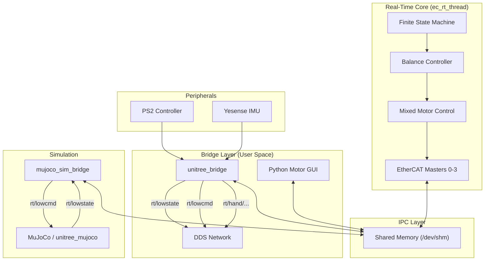

# G1 Motor Control Software

This repository contains the custom EtherCAT-based motor control software for the Unitree G1 humanoid robot. It creates a high-performance, real-time control loop that bridges the gap between the robot's hardware (29 mixed motors + 2 hands) and high-level control algorithms (ROS2/DDS, Python GUI).

## Project Overview

The system is designed to provide **unitree_sdk2 compatibility** while running on custom EtherCAT hardware. It replaces the stock control stack with a flexible, open architecture.

### Key Capabilities

*   **Mixed Motor Architecture**: Seamlessly controls Unitree SE motors (Legs/Waist) and LS motors (Arms) in a single 1kHz loop.
*   **ROS2 / SDK2 Bridge**: Exposes standard `rt/lowstate` and `rt/lowcmd` DDS topics, making the robot appear as a standard Unitree G1 to external software.
*   **Balance Controller**: Pinocchio-based gravity compensation with IMU-feedback PID for standing balance (ankle/hip/waist strategy).
*   **MuJoCo Simulation**: Full-physics simulation bridge using `unitree_mujoco`, with standalone and digital-twin mirror modes.
*   **Integrated Peripherals**: Native support for LS Dexterous Hands, Yesense IMU, and PS2 Wireless Controller.
*   **Safety FSM**: Real-time Finite State Machine for safe transitions (Sit, Stand, Squat, Zero Torque).

## System Architecture

The system consists of three isolated layers interacting via Shared Memory (IPC):



## Dependencies

| Dependency | Required | Purpose |
| :--- | :--- | :--- |
| **IgH EtherCAT Master** | Hardware only | EtherCAT communication |
| **CycloneDDS** | Yes | DDS messaging (bridges, examples) |
| **Pinocchio** | Optional | Gravity compensation (balance controller) |
| **Eigen3** | With Pinocchio | Linear algebra for Pinocchio |
| **LHandProLib** | Optional | LS dexterous hand control |
| **PySide6** | Optional | Python motor GUI |

### Installing Pinocchio (for balance controller)

```bash
# Via robotpkg (installs to /opt/openrobots)
sudo tee /etc/apt/sources.list.d/robotpkg.list <<EOF
deb [arch=amd64] http://robotpkg.openrobots.org/packages/debian/pub $(lsb_release -cs) robotpkg
EOF
curl http://robotpkg.openrobots.org/packages/debian/robotpkg.key | sudo apt-key add -
sudo apt update
sudo apt install robotpkg-pinocchio
```

## Build

### CMake Options

| Option | Default | Description |
| :--- | :--- | :--- |
| `USE_MOCK_ECAT` | `OFF` | Use mock EtherCAT API (no hardware required) |
| `ENABLE_BALANCE` | `ON` | Enable Pinocchio balance controller |
| `BUILD_DDS_BRIDGE` | `ON` | Build DDS bridges and examples |
| `BUILD_RT_THREAD` | `ON` | Build real-time EtherCAT thread |
| `BUILD_GUI` | `ON` | Build Python GUI setup |

### Build for Real Hardware

```bash
mkdir build && cd build
cmake -DCMAKE_BUILD_TYPE=Release ..
# Build (portable): use CMake's build wrapper so it works with Make or Ninja
# - Linux: getconf or nproc
# - macOS: sysctl
# Examples:
#  Portable (POSIX):
cmake --build . -- -j"$(getconf _NPROCESSORS_ONLN)"
#  Linux (alternative):
# cmake --build . -- -j"$(nproc)"
#  macOS (alternative):
# cmake --build . -- -j"$(sysctl -n hw.ncpu)"
```

### Build for Simulation (Mock EtherCAT)

```bash
mkdir build && cd build
cmake -DUSE_MOCK_ECAT=ON -DCMAKE_BUILD_TYPE=Release ..
# Build using CMake's build wrapper (works with Make or Ninja generators):
cmake --build . -- -j"$(getconf _NPROCESSORS_ONLN)"
# Linux alternative: cmake --build . -- -j"$(nproc)"
# macOS alternative: cmake --build . -- -j"$(sysctl -n hw.ncpu)"
```

### Build without Balance Controller

If Pinocchio is not installed, the balance controller is automatically disabled. To explicitly disable it:
```bash
cmake -DENABLE_BALANCE=OFF -DCMAKE_BUILD_TYPE=Release ..
```

### Build Outputs

All binaries are placed in `build/bin/`:

| Binary | Description |
| :--- | :--- |
| `ec_rt_thread` | Real-time EtherCAT control loop + FSM |
| `unitree_bridge` | SDK2/ROS2 compatible DDS bridge |
| `dds_bridge` | Basic DDS bridge |
| `mujoco_sim_bridge` | MuJoCo simulation bridge |
| `g1_loco_client_test` | Locomotion API test client |
| `g1_lowcmd_example` | Low-level motor command example |
| `g1_lowstate_monitor` | Motor state monitoring tool |
| `g1_arm_sdk_example` | Arm control example |
| `g1_hand_example` | Dexterous hand control example |
| `test_ps2_controller` | PS2 controller diagnostics |

## Run

### Option 1: Real Hardware

**Step 1** - Start the real-time thread (must run first):
```bash
sudo ./build/bin/ec_rt_thread
```

**Step 2** - Start a bridge or interface:
```bash
# Unitree Bridge (connects to ROS2/SDK2)
./build/bin/unitree_bridge --network_interface=eth0

# OR Python GUI (direct shared memory)
python3 python/motor_gui.py
```

### Option 2: MuJoCo Simulation

The MuJoCo simulation bridge connects the FSM and balance controller to `unitree_mujoco` over DDS, providing full-physics testing without hardware.

**Step 1** - Start `unitree_mujoco` (separate project):
```bash
# In your unitree_mujoco directory
python3 unitree_mujoco/main.py
```

**Step 2** - Start the simulation bridge:
```bash
./build/bin/mujoco_sim_bridge
```

The bridge runs in **standalone mode** by default: it owns shared memory, runs the FSM, gait generator, balance controller, and DDS service servers. Use the FSM to transition through states (e.g. Stand) and the balance controller activates automatically.

**Mirror mode** (digital twin):
```bash
./build/bin/mujoco_sim_bridge --mirror
```
In mirror mode, the bridge attaches to existing shared memory owned by `ec_rt_thread` and forwards real motor commands to MuJoCo, acting as a real-time digital twin of the physical robot.

### Option 3: Mock EtherCAT Simulation

For testing the RT thread without hardware or MuJoCo:
```bash
# Build with mock EtherCAT (see Build section)
sudo ./build/bin/ec_rt_thread
# Then attach bridge or GUI as in Option 1
```

## Feature Details

### 1. Finite State Machine (FSM)
Implemented in the real-time thread (`src/g1_fsm.c`) to ensure safe operation.
*   **Zero Torque**: Emergency stop / Passive mode.
*   **Damp**: High damping for safe manual handling.
*   **Squat / Sit / Stand**: Smooth 2-second interpolated transitions between poses.
*   **Locomotion**: Active mode for receiving external gait commands.

### 2. Balance Controller
Pinocchio-based balance controller (`src/g1_balance.cpp`) activated during Stand/Locomotion states.
*   **Gravity Compensation**: Uses Pinocchio RNEA (Recursive Newton-Euler) with the G1 MuJoCo model (`config/g1.xml`) to compute feedforward torques.
*   **IMU Feedback PID**: Ankle strategy (pitch + roll), hip strategy, and waist correction using IMU orientation feedback.
*   **Nominal Position Hold**: All non-FSM joints hold their activation-time positions with KP restoring force, preventing drift.
*   **RT-Safe Logging**: Ring buffer logging avoids `printf` calls in the 1kHz real-time loop.

### 3. Unitree Bridge & ROS2/DDS
The `unitree_bridge` application provides full API compatibility.
*   **Topics**:
    *   `rt/lowstate`: Publishes full robot state (Motor q/dq/tau, IMU, Wireless Remote).
    *   `rt/lowcmd`: Subscribes to motor commands.
*   **Integration**: Allows using the official `unitree_sdk2` or ROS2 nodes to control this custom stack.

### 4. LS Dexterous Hands
Integrated on Masters 2 (Left) and 3 (Right).
*   **Control**: Position/Velocity/Current control via EtherCAT.
*   **Feedback**: Real-time pressure, force, and proximity sensor data.
*   **DDS Interface**:
    *   `rt/hand/left/cmd`, `rt/hand/right/cmd`
    *   `rt/hand/left/state`, `rt/hand/right/state`

### 5. Peripherals
*   **PS2 Controller**: Plug-and-play support. Data is accessible via `LowState.wireless_remote`, enabling teleoperation demos.
*   **Yesense IMU**: High-speed serial driver (460800 baud) providing Quaternion/Gyro/Accel data to the DDS network.

## Hardware Configuration

| Master | Body Parts | Motor Type | Count | Notes |
| :--- | :--- | :--- | :--- | :--- |
| **0** | Left Leg (6) | SE | 6 | |
| **1** | Right Leg (6) | SE | 6 | |
| **2** | Left Arm (7) + Waist (3) | LS | 10 | + Left Hand (Slave 10) |
| **3** | Right Arm (7) | LS | 7 | + Right Hand (Slave 7) |

## Development History & Milestones

1.  **G1 Redefinition**: Transitioned to a 4-Master EtherCAT topology to handle 29 motors.
    *   **Master 0-1**: Legs (SE Motors).
    *   **Master 2-3**: Arms & Waist (LS Motors) & Hands.
2.  **Simulation First**: Developed `ecrt_mock` and `shm_sim` to simulate motor physics and CiA 402 state machines without hardware.
3.  **Bridge Implementation**: Created `unitree_bridge` to translate internal shared memory data into standard `LowState`/`LowCmd` DDS messages.
4.  **Peripheral Integration**:
    *   **PS2 Controller**: Mapped to `wireless_remote` for manual robot control.
    *   **LS Hands**: Integrated into the real-time loop with separate DDS topics.
    *   **IMU**: Custom driver for high-speed orientation data.
5.  **MuJoCo Simulation Bridge**: Created `mujoco_sim_bridge` for full-physics testing with `unitree_mujoco`, supporting standalone and mirror modes.
6.  **Balance Controller**: Pinocchio-based gravity compensation with IMU PID feedback for standing balance.

## Documentation Reference
*   [FSM Implementation](docs/FSM_IMPLEMENTATION.md) - Detailed FSM interactions.
*   [G1 Redefinition](docs/G1%20Robot%20Redefinition.md) - Joint mapping details.
*   [Motor Test GUI](docs/Motor%20Test%20GUI.md) - Guide for using the Python visualization tool.
*   [Yesense IMU](docs/Yesense%20IMU.md) - Details on the IMU integration and data format.
*   [Simulator Guide](docs/simulator_files.md) - Using the shared memory simulator.

