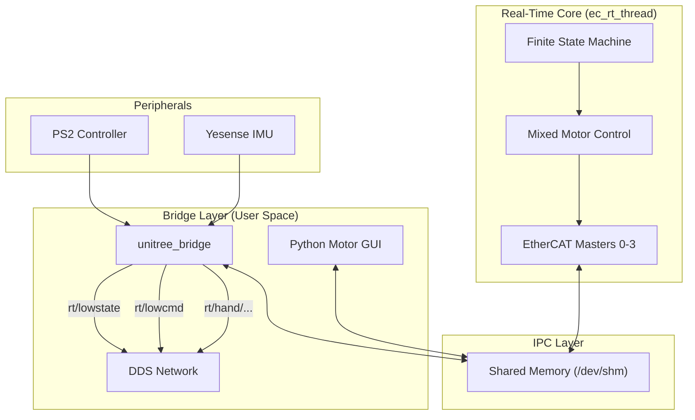

# G1 Motor Control Software

This repository contains the custom EtherCAT-based motor control software for the Unitree G1 humanoid robot. It creates a high-performance, real-time control loop that bridges the gap between the robot's hardware (29 mixed motors + 2 hands) and high-level control algorithms (ROS2/DDS, Python GUI).

## Project Overview

The system is designed to provide **unitree_sdk2 compatibility** while running on custom EtherCAT hardware. It replaces the stock control stack with a flexible, open architecture.

### Key Capabilities

*   **Mixed Motor Architecture**: Seamlessly controls Unitree SE motors (Legs/Waist) and LS motors (Arms) in a single 1kHz loop.
*   **ROS2 / SDK2 Bridge**: Exposes standard `rt/lowstate` and `rt/lowcmd` DDS topics, making the robot appear as a standard Unitree G1 to external software.
*   **Integrated Peripherals**: Native support for LS Dexterous Hands, Yesense IMU, and PS2 Wireless Controller.
*   **Safety FSM**: Real-time Finite State Machine for safe transitions (Sit, Stand, Squat, Zero Torque).
*   **Simulation**: High-fidelity Shared Memory Simulator and Mock EtherCAT layer for hardware-free development.

## Development History & Milestones

The project has evolved through several phases to reach its current state:

1.  **G1 Redefinition**: Transitioned to a 4-Master EtherCAT topology to handle 29 motors.
    *   **Master 0-1**: Legs (SE Motors).
    *   **Master 2-3**: Arms & Waist (LS Motors) & Hands.
2.  **Simulation First**: Developed `ecrt_mock` and `shm_sim` to simulate motor physics and CiA 402 state machines without hardware.
3.  **Bridge Implementation**: Created `unitree_bridge` to translate internal shared memory data into standard `LowState`/`LowCmd` DDS messages.
4.  **Peripheral Integration**:
    *   **PS2 Controller**: Mapped to `wireless_remote` for manual robot control.
    *   **LS Hands**: Integrated into the real-time loop with separate DDS topics.
    *   **IMU**: Custom driver for high-speed orientation data.

## System Architecture

The system consists of three isolated layers interacting via Shared Memory (IPC):



## Feature Details

### 1. Finite State Machine (FSM)
Implemented in the real-time thread (`src/g1_fsm.c`) to ensure safe operation.
*   **Zero Torque**: Emergency stop / Passive mode.
*   **Damp**: High damping for safe manual handling.
*   **Squat / Sit / Stand**: Smooth 2-second interpolated transitions between poses.
*   **Locomotion**: Active mode for receiving external gait commands.

### 2. Unitree Bridge & ROS2/DDS
The `unitree_bridge` application provides full API compatibility.
*   **Topics**:
    *   `rt/lowstate`: Publishes full robot state (Motor q/dq/tau, IMU, Wireless Remote).
    *   `rt/lowcmd`: Subscribes to motor commands.
*   **Integration**: Allows using the official `unitree_sdk2` or ROS2 nodes to control this custom stack.

### 3. LS Dexterous Hands
Integrated on Masters 2 (Left) and 3 (Right).
*   **Control**: Position/Velocity/Current control via EtherCAT.
*   **Feedback**: Real-time pressure, force, and proximity sensor data.
*   **DDS Interface**:
    *   `rt/hand/left/cmd`, `rt/hand/right/cmd`
    *   `rt/hand/left/state`, `rt/hand/right/state`

### 4. Peripherals
*   **PS2 Controller**: Plug-and-play support. Data is accessible via `LowState.wireless_remote`, enabling teleoperation demos.
*   **Yesense IMU**: High-speed serial driver (460800 baud) providing Quaternion/Gyro/Accel data to the DDS network.

## Hardware Configuration

| Master | Body Parts | Motor Type | Count | Notes |
| :--- | :--- | :--- | :--- | :--- |
| **0** | Left Leg (6) | SE | 6 | |
| **1** | Right Leg (6) | SE | 6 | |
| **2** | Left Arm (7) + Waist (3) | LS | 10 | + Left Hand (Slave 10) |
| **3** | Right Arm (7) | LS | 7 | + Right Hand (Slave 7) |

## Build & Run

### 1. Build
```bash
mkdir build && cd build
# Simulation Mode (recommended for dev)
cmake -DUSE_MOCK_ECAT=ON -DCMAKE_BUILD_TYPE=Release ..
# Real Hardware
# cmake -DCMAKE_BUILD_TYPE=Release ..
make -j4
```

### 2. Run Real-Time Thread
Must run first. Handles EtherCAT/Mock communication and FSM.
```bash
# Requires root for real-time scheduling
sudo ./bin/ec_rt_thread
```

### 3. Run Bridges & Interfaces
**Option A: Unitree Bridge (Recommended)**
Connects to ROS2/SDK2 applications.
```bash
./bin/unitree_bridge --network_interface=eth0
```

**Option B: Python GUI (Testing)**
Direct shared memory visualization.
```bash
python3 python/motor_gui.py
```

## Documentation Reference
*   [FSM Implementation](FSM_IMPLEMENTATION.md) - Detailed FSM interactions.
*   [G1 Redefinition](docs/G1%20Robot%20Redefinition.md) - Joint mapping details.
*   [Motor Test GUI](docs/Motor%20Test%20GUI.md) - Guide for using the Python visualization tool.
*   [Yesense IMU](docs/Yesense%20IMU.md) - Details on the IMU integration and data format.
*   [Simulator Guide](docs/simulator_files.md) - Using the shared memory simulator.
