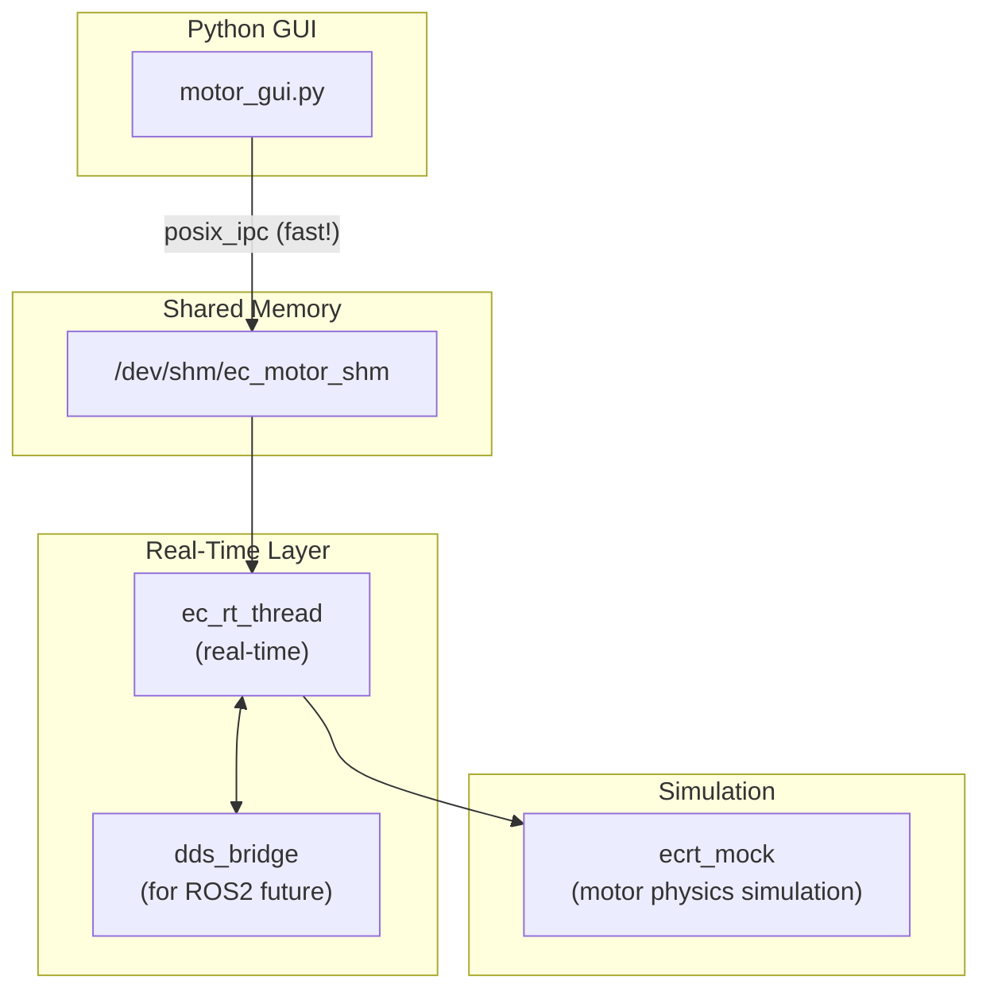

# Motor Test GUI Walkthrough

## Summary
Built a unified motor control system for SE and LS motors with:
- Mock EtherCAT API for simulation
- Direct shared memory GUI for fast response
- DDS bridge for future ROS2 integration

## Architecture



## Key Files

| Component | File | Description |
|-----------|------|-------------|
| Mock EtherCAT | `src/ecrt_mock.c` | Simulates motor physics |
| RT Thread | `src/ec_rt_thread.c` | Unified SE+LS control |
| Shared Memory | `src/ec_shared_mem.h` | IPC data structures |
| DDS Bridge | `src/dds_bridge.cpp` | For ROS2 integration |
| GUI | `python/motor_gui.py` | Direct SHM access |

## Usage

```bash
# Build with mock EtherCAT
cd build
cmake -DUSE_MOCK_ECAT=ON ..
make -j$(nproc)

# Run RT thread (requires root for real-time scheduling)
sudo ./bin/ec_rt_thread -s 2 -l 2

# Run GUI (direct shared memory - fast!)
python3 python/motor_gui.py

# Optional: DDS bridge for ROS2 integration
./bin/dds_bridge
```

## Motor Types
- **SE Motor (type=0)**: Simplified protocol with direct impedance control
- **LS Motor (type=1)**: CiA 402 with CST mode, impedance control wrapper

## Control Parameters
- `target_pos`: Target position (rad)
- `target_vel`: Target velocity (rad/s)
- `target_tff`: Feedforward torque (N·m)
- `KP`: Position gain
- `KD`: Velocity/damping gain

## Next Steps
- ROS2 integration via DDS bridge
- Humanoid robot joint control
- Real EtherCAT hardware testing (set USE_MOCK_ECAT=OFF)

